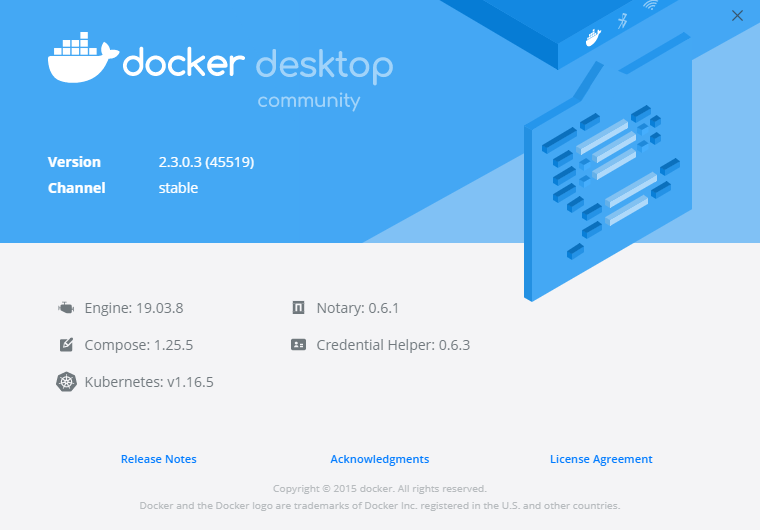

# Docker Study
學習之後，製作成筆記，方便日後使用時復習

- 

```shell
docker version      # 顯示docker的版本信息
docker info         # 顯示docker的系統信息，包括鏡像和容器的數量
docker 命令 --help  # 幫助命令
```

# 鏡像命令
```shell
docker images      # 查看所有本地主機上的鏡像
```
```shell
# 參數
-a  # 列出所有鏡像
-q  # 只顯示鏡像的id
```

**docker search 搜索鏡像**
```shell
docker search mysql # 搜索mysql鏡像
```
```shell
# 參數
--filter=STARS=3000 #搜索出來的鏡像就是STARS大于3000的
```

```shell
docker search mysql --filter=STARS=3000 #搜索出來的鏡像就是STARS大于3000的
```

**docker pull 下載鏡像**
```shell
# 下載鏡像 docker pull 鏡像名[:tag]
docker pull mysql # 如果不寫tag，默認就是latest
```
```shell
# 指定版本下載
docker pull mysql:5.7 
```

**docker rmi 刪除鏡像**
```shell
# docker rmi imageID
docker rmi -f df5fed73c608 
```
```shell
# 刪除所有鏡像(實測會出錯)
docker rmi -f $(docker images -aq)
```

# 容器命令
**先有鏡像才能創建容器，下載一個centos鏡像來測試學習**
```shell
docker pull centos
```
**新建容器並啟動**
```shell
docker run [可選參數] image
# 參數說明
--name="Name"   # 容器名字
-d              # 後台方式運行
-it             # 使用交互方式運行，進入容器查看內容
-p              # 指定容器的端口 -p 8080:8080
    -p ip:主機端口:容器端口 
    -p 主機端口:容器端口 (常用)
    -P 容器端口
-P              # 隨機指定端口
# 測試, 啟動並進入容器
docker run -it centos /bin/bash
# 從容器中退回主機
exit
```
```shell
# docker ps 命令
        # 列出當前正在運行的容器
-a      # 列出當前正在運行的容器+帶出歷史運行過的容器
-n=?    # 顯示最近創建的容器，?代表數量
-q      # 只顯示容器的編號 
```
**退出容器**
```shell
exit            # 直接容器停止並退出
Ctrl + P + Q    # 容器不停止退出
```
**刪除容器**
```shell
docker rm 容器id                # 刪除指定的容器，不能刪除正在運行的容器，如果要強制刪除 rm -f
docker rm -f $(docker ps -aq)   #刪除所有容器
docker ps -a -q|xargs docker rm
```
**啟動和停止容器的操作**
```shell
docker start 容器id     # 啟動容器 
docker restart 容器id   # 重啟容器
docker stop 容器id      # 停止當前正在運行的容器
docker kill 容器id      # 啟動容器
docker rm -f $(docker ps -aq)   #刪除所有容器
docker ps -a -q|xargs docker rm
```

# 常用其它命令
**後台啟動容器**
```shell
# 命令 docker run -d 鏡像名
docker run -d centos
# 問題docker ps 發現 centos 停止了
# 常見的坑：docker容器使用後台進行，就必須要有一個前台進程，docker發現沒有應用，就會自動停止
```
**查看日誌**
```shell
# docker logs -f -t --tail 容器沒有日誌，自動寫一段腳本測試使用
"while true;do echo ivesshe;sleep 1;done"
# 自動編寫一段shell腳本，-c 寫命令
docker run -d centos /bin/sh -c "while true;do echo ivesshe;sleep 1;done"
# 顯示日誌
-tf
--tail number #要顯示日志條數
docker logs -tf --tail 筆數 容器id
docker logs -tf --tail 10 aaf5f204b951
```
**查看容器中進程信息**
```shell
# docker top 容器id
docker top aaf5f204b951
```
**查看容器中進程信息**
```shell
# docker inspect 容器id
docker inspect aaf5f204b951
```
**進入當前正在運行的容器**
```shell
# 通常容器是使用後台方式運行的，需要進入容器，修改一些配置
# 命令

# 方式一
# docker exec it 容器id bashShell
docker exec -it aaf5f204b951 /bin/bash
ps -ef # linux查看進程?

# 方式二
# docker attach 容器id 
docker attach aaf5f204b951
# 正在執行當前的代碼

# docker exec   -> 進入容器後開啟一個新的終端，可以在裡面操作(常用)
# docker attach -> 進入容器正在執行的終端，不會啟動新的進程
```
**從容器內拷貝文件到主機上**
```shell
# docker cp 容器id:容器內路徑 目的的主機路徑
docker cp aaf5f204b951
docker cp aaf5f204b951:/home/ives_java.java /home
docker cp aaf5f204b951:/home/java.java /home
# 拷貝是一個手動過程，之後會使用 -v 卷的技術，可以實現自動同步
```

# 作業練習一
> Docker安裝Nginx
```shell
# 1、搜索鏡像 search
# 2、下載鏡像 pull
# 3、運行測試
docker run -d --name nginx03 -p 3344:80 nginx
curl localhost:3344
docker exec -it nginx03 /bin/bash
whereis nginx
ls
cd /etc/nginx
```
[localhost:3344](http://localhost:3344/)

# 作業練習二
> Docker安裝Tomcat
```shell
# 官方的使用
docker run -it --rm tomcat:9.0
# 之前的啟動都是後台，停止了容器之後，容器還是可以查到
# docker run -it --rm 一般用來測試，用完就刪除

# 下載再啟動
docker pull tomcat
docker run -d -p 3355:8080 --name tomcat03 tomcat
curl localhost:3355

# 進入容器
docker exec -it tomcat03 /bin/bash
cd webapps
ls
# 發現
# 1.linux命令少了
# 2.沒有webapps, 下載的鏡像，默認是最小的鏡像，所有不必要的東西都剔除掉
# 保證最小可運行的環境
cd ..
cd webapps.dist
ls
cd ..
cp -r webapps.dist/* webapps
cd webapps
ls
```
[localhost:3355](http://localhost:3355/)

# 作業練習三
> Docker 部署es(elasticsearch)+kibana
```shell
# es 暴露的端口很多
# es 十分的耗內存
# es 的數據一般需要放置到安全目錄 掛載
# --net somenetwork -> 網路配置
# docker run -d --name elasticsearch --net somenetwork -p 9200:9200 -p 9300:9300 -e "discovery.type=single-node" elasticsearch:tag

# 啟動elasticsearch
docker run -d --name elasticsearch -p 9200:9200 -p 9300:9300 -e "discovery.type=single-node" elasticsearch:7.6.2

# es十分耗內存的，1.268G
# 查看 docket stats
docker stats

curl localhost:9200
# 增加內存限制的測試 -e環境配置修改
docker run -d --name elasticsearch02 -p 9200:9200 -p 9300:9300 -e "discovery.type=single-node" -e ES_JAVA_OPTS="-Xms64m -Xmx512m" elasticsearch:7.6.2
```
[localhost:9200](http://localhost:9200/)

# 可視化
- portainer
```shell
docker run -d -p 8088:9000 --restart=always -v /var/run/docker.sock:/var/run/docker.sock --privileged=true portainer/portainer

curl localhost:8088
```
[localhost:8088](http://localhost:8088/)

# Docker鏡像分層
```shell
docker images
docker image inspect 62771b0b9b09
```

# commit鏡像
```shell
# docker commit 提交容器成為一個新的副本

# 命令和git原理類似
# docker commit -m="提交的描述信息" -a="作者" 容器id 目標鏡像名:[TAG]

docker pull tomcat
docker run -it -p 8080:8080 tomcat
docker ps
docker exec -it 182628cdd4f1 /bin/bash
cp -r webapps.dist/* webapps
cd webapps
ls
cd ..
```
實戰測試
```shell
# 1.啟動一個默認的tomcat
# 2.發現這個默認的tomcat 是沒有webapps應用，因為鏡像的原因，官方的鏡像默認webapps下面是沒有文件的
# 3.現在自己拷貝進去基本的文件進去
# 4.將操作過的容器通過commit提交為一個鏡像，以後就使用修改過的鏡像即可
docker commit -a="ivesshe" -m="add webapps app" 182628cdd4f1 tomcat02:1.0
docker run -it -p 8080:8080 de0e6cedcaf7
```
[localhost:8080](http://localhost:8080/)

# 容器數據卷
==數據可以持久化==
==MySQL數據可以存儲在本地==
**容器間也可以數據共享**

# 使用數據卷
> 方式一：直接使用命令來掛載 -v

```shell
# docker run -it -v 主機目錄:容器內目錄

#測試
docker run -it -v /home/ceshi:/home centos /bin/bash
docker inspect 32f1789d42b7
```
```json
"Mounts": [
            {
                "Type": "bind",
                "Source": "/home/ceshi",
                "Destination": "/home",
                "Mode": "",
                "RW": true,
                "Propagation": "rprivate"
            }
        ],
```
即使容器停止，數據綁定依舊是同步的
```shell
touch test.java
vim test.java
cat test.java
```
# 實戰：安裝MySQL
> 方式一：直接使用命令來掛載 -v

```shell
# 獲取鏡像
docker pull mysql:5.7

# 官文範例
$ docker run --name some-mysql -e MYSQL_ROOT_PASSWORD=my-secret-pw -d mysql:tag

# -d 後台運行
# -p 端口映射
# -v 卷掛載
# -e 環境配置
# --name 容器名字
docker run -d -p 3310:3306 -v /home/mysql/conf:/etc/mysql/conf.d -v /home/mysql/data:/var/lib/mysql -e MYSQL_ROOT_PASSWORD=123456 --name mysql01 mysql:5.7

# 啟動成功後，在本地使用SQLyog連接測試
# SQLyog 連接到服務器的3310 和容器內的3306映射
```
即使容器被刪除，掛載到本地的數據卷依舊不會丟失

# 具名和匿名掛載
```shell
# 匿名掛載
docker run -d -P --name nginx05 -v /etc/nginx nginx
# 查看所有的volume的情況
docker volume ls

# 具名掛載
docker run -d -P --name nginx06 -v juming-nginx:/etc/nginx nginx

# 通過-v 卷名:容器內路徑
# 查看一下這個卷
docker volume inspect juming-nginx
```
docker所有的容器內的卷，沒有指定目錄的情況下都是在 ==/var/lib/docker/volumes/xxxxxxxxxxxx/_data==
通過具名掛載可以方便的找到我們的一個卷，大多數情況使用 **具名掛載**
```shell
# 如何確定是具名掛載還是匿名掛載、還是指定路徑掛載
-v 容器內路徑       # 匿名掛載
-v 卷名:容器內路徑       # 具名掛載
-v /宿主機路徑:容器內路徑       # 指定路徑掛載
```
擴展
```shell
# 通過 -v 容器內徑:ro rw 改變讀寫讀限
ro  read only       # 只讀
rw  read write      # 可讀可寫

# 一旦設置了容器權限，容器對我們掛載出來的內容就有限定了
docker run -d -P --name nginx06 -v juming-nginx:/etc/nginx:ro nginx
docker run -d -P --name nginx06 -v juming-nginx:/etc/nginx:rw nginx

# ro 只要看到ro就說明這個路徑只能通過宿主機來操作，容器內部是無法操作的
```

# 初識Dockerfile
dockerfile就是用來構建docker鏡像的構建文件，命令腳本
通過這個腳本可以生成鏡像，鏡像是一層一層的，腳本一個個的命令，每個命令都是一層

> 方法二：
```shell
vim dockerfile1
cat dockerfile1
```
```shell
# 創建一個dockerfile文件，名字可以隨機，建議Dockerfile
# 文件中的內容 指令(大寫) 參數
# "volume01","volume02"為匿名掛載
FROM centos

VOLUME ["volume01","volume02"]

CMD echo "----end----"
CMD /bin/bash
```
```shell
docker build -f dockerfile1 -t ivesshe/centos .
docker images
docker run -it e8d5908feabe /bin/bash
```
# 數據卷容器
多個mysql同步數據

# 啟動三個容器 
docker run -it --name docker01 ivesshe/centos
docker run -it --name docker02 --volumes-from docker01 ivesshe/centos
docker run -it --name docker03 --volumes-from docker01 ivesshe/centos

```shell
# 可以刪除docker01，查看一下docker02和docker03是否還可以訪問這個文件
# 測試結果依舊可以訪問
```
多個mysql同步數據
```shell
docker run -d -p 3310:3306 -v /etc/mysql/conf.d -v /var/lib/mysql -e MYSQL_ROOT_PASSWORD=123456 --name mysql01 mysql:5.7
docker run -d -p 3310:3306 -e MYSQL_ROOT_PASSWORD=123456 --name mysql02 --volumes-from mysql01 mysql:5.7

```
結論：
容器之間配置信息的傳遞，數據卷容器的生命周期一直持續到沒有容器使用為止
但是一互持久化到了本地，這個時候，本地的數據是不會刪除的

# DockerFile介紹
dockerfile就是用來構建docker鏡像的構建文件，命令腳本
構建步驟
1、編寫一個dockerfile文件
2、docker build 構建成為一個鏡像
3、docker run 運行鏡像
4、docker push 發布鏡像 (DockerHub、阿里雲鏡像倉庫)

很多官方鏡像都是基礎包，很多功能沒有，我們通常會自己搭建自己的鏡像

# DockerFile構建過程
**基礎知識**
1、每個保留關鍵字(指令)都必須是大寫字母
2、執行從上到下順序執行
3、#表示注解
4、每一個指令都會創建提交一個新的鏡像層，並提交

步驟：開發、部署、運維…缺一不可

dockerfile是面向開發的
DockerFile： 構建文件，定義了一切的步驟，源代碼
DockerImages：通過DockerFile構建生成的鏡像，最後發布和運行的產品
Docker容器：容器就是鏡像運行起來的服務器

```shell
# 可以刪除docker01，查看一下docker02和docker03是否還可以訪問這個文件
# 測試結果依舊可以訪問
```

# DockerFile的指令
```shell
FROM            # 基礎鏡像，一切從這裡開始構建
MAINTAINER      # 鏡像是誰寫的，姓名+郵箱
RUN             # 鏡像構建的時候需要運行的命令
ADD             # 步驟：tomcat鏡像，這個tomcat壓縮包，添加內容
WORKDIR         # 鏡像的工作目錄
VOLUME          # 掛載的目錄
EXPOST          # 保留端口配置
CMD             # 指定這個容器啟動的時候要運行的命令 EX. CMD ECHO
ENTRYPOINT      # 指定這個容器啟動的時候要運行的命令，可以追加命令
ONBUILD         # 當構建一個被繼承 DockerFile 這個時候就會運行 ONBUILD 的指令，觸發指令
COPY            # 類似ADD，將文件拷貝到鏡像中
ENY             # 構建的時候設置環境變量
```

# 實戰測試
> 創建一個自己的centos
```shell
# 1、編寫Dockfile的文件
FROM centos
MAINTAINER ivesshe<ivesshe@gmail.com>

ENV MYPATH /usr/local
WORKDIR $MYPATH

RUN yun -y install vim
RUN yun -y install net-tools

EXPOSE 80
CMD echo $MYPAATH
CMD echo "---end---"
CMD /bin/bash

# 2、通過這個文件構建鏡像
# 命令 docker build -f dockerfile文件路徑 -t 鏡像名:[TAG]
docker build -f mydockerfile-centos -t mycentos:0.1 .
docker run -it mycentos:0.1 

docker history b9656c554c75
```

> CMD 和 ENTRYPOINT 區別
```shell
CMD             # 指定這個容器啟動的時候要運行的命令，只有最後一個會生效，可被替代
ENTRYPOINT      # 指定這個容器啟動的時候要運行的命令，可以追加命令
```


---
# 筆記到p29