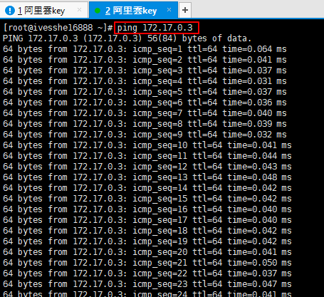
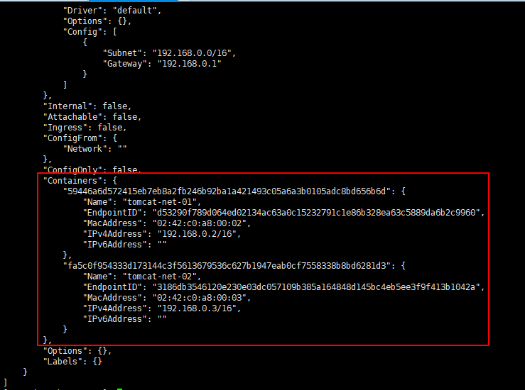

# Docker Study
學習之後，製作成筆記，方便日後使用時復習

- 

# CentOS7 安裝docker

> 環境查看
```shell
# 系統內核是3.10以上
uname -r
# 查看linux系統版本
cat /etc/os-release
```


> 安裝

[參考網址](https://docs.docker.com/engine/install/centos/)

```shell
# 1.卸載舊版本
yum remove docker \
                  docker-client \
                  docker-client-latest \
                  docker-common \
                  docker-latest \
                  docker-latest-logrotate \
                  docker-logrotate \
                  docker-engine

# 2.需要的安裝包      
yum install -y yum-utils
```


```shell
# 3.設置鏡像的倉庫
yum-config-manager \
    --add-repo \
    https://download.docker.com/linux/centos/docker-ce.repo
```


```shell
# 更新yum軟體包索引 
yum makecache fast
```


```shell
# 4.安裝DOCKER ENGINE 
# docker-ce 社區版
yum install docker-ce docker-ce-cli containerd.io
```


```shell
# 5.Start Docker 啟動docker
systemctl start docker

# 6.使用docker version 是否安裝成功
docker version
```


```shell
# 7. hello-world
docker run hello-world
```


```shell
# 8. 查看一下hello-world鏡像
docker images
```


> 了解卸載docker依賴

```shell
# 1. 卸載依賴
yum remove docker-ce docker-ce-cli containerd.io

# 2. 卸載資源
rm -rf /var/lib/docker

# /var/lib/docker docker的默認工作路徑
```

-------

```shell
docker version      # 顯示docker的版本信息
docker info         # 顯示docker的系統信息，包括鏡像和容器的數量
docker 命令 --help  # 幫助命令
```

# 有一部分在windows的環境練習，也沒有截圖，只單純記錄指令

# 鏡像命令
```shell
docker images      # 查看所有本地主機上的鏡像
```
```shell
# 參數
-a  # 列出所有鏡像
-q  # 只顯示鏡像的id
```

**docker search 搜索鏡像**
```shell
docker search mysql # 搜索mysql鏡像
```
```shell
# 參數
--filter=STARS=3000 #搜索出來的鏡像就是STARS大于3000的
```

```shell
docker search mysql --filter=STARS=3000 #搜索出來的鏡像就是STARS大于3000的
```

**docker pull 下載鏡像**
```shell
# 下載鏡像 docker pull 鏡像名[:tag]
docker pull mysql # 如果不寫tag，默認就是latest
```
```shell
# 指定版本下載
docker pull mysql:5.7 
```

**docker rmi 刪除鏡像**
```shell
# docker rmi imageID
docker rmi -f df5fed73c608 
```
```shell
# 刪除所有鏡像(實測會出錯)
docker rmi -f $(docker images -aq)
```

# 容器命令
**先有鏡像才能創建容器，下載一個centos鏡像來測試學習**
```shell
docker pull centos
```
**新建容器並啟動**
```shell
docker run [可選參數] image
# 參數說明
--name="Name"   # 容器名字
-d              # 後台方式運行
-it             # 使用交互方式運行，進入容器查看內容
-p              # 指定容器的端口 -p 8080:8080
    -p ip:主機端口:容器端口 
    -p 主機端口:容器端口 (常用)
    -P 容器端口
-P              # 隨機指定端口
# 測試, 啟動並進入容器
docker run -it centos /bin/bash
# 從容器中退回主機
exit
```
```shell
# docker ps 命令
        # 列出當前正在運行的容器
-a      # 列出當前正在運行的容器+帶出歷史運行過的容器
-n=?    # 顯示最近創建的容器，?代表數量
-q      # 只顯示容器的編號 
```
**退出容器**
```shell
exit            # 直接容器停止並退出
Ctrl + P + Q    # 容器不停止退出
```
**刪除容器**
```shell
docker rm 容器id                # 刪除指定的容器，不能刪除正在運行的容器，如果要強制刪除 rm -f
docker rm -f $(docker ps -aq)   #刪除所有容器
docker ps -a -q|xargs docker rm
```
**啟動和停止容器的操作**
```shell
docker start 容器id     # 啟動容器 
docker restart 容器id   # 重啟容器
docker stop 容器id      # 停止當前正在運行的容器
docker kill 容器id      # 啟動容器
docker rm -f $(docker ps -aq)   #刪除所有容器
docker ps -a -q|xargs docker rm
```

# 常用其它命令
**後台啟動容器**
```shell
# 命令 docker run -d 鏡像名
docker run -d centos
# 問題docker ps 發現 centos 停止了
# 常見的坑：docker容器使用後台進行，就必須要有一個前台進程，docker發現沒有應用，就會自動停止
```
**查看日誌**
```shell
# docker logs -f -t --tail 容器沒有日誌，自動寫一段腳本測試使用
"while true;do echo ivesshe;sleep 1;done"
# 自動編寫一段shell腳本，-c 寫命令
docker run -d centos /bin/sh -c "while true;do echo ivesshe;sleep 1;done"
# 顯示日誌
-tf
--tail number #要顯示日志條數
docker logs -tf --tail 筆數 容器id
docker logs -tf --tail 10 aaf5f204b951
```
**查看容器中進程信息**
```shell
# docker top 容器id
docker top aaf5f204b951
```
**查看容器中進程信息**
```shell
# docker inspect 容器id
docker inspect aaf5f204b951
```
**進入當前正在運行的容器**
```shell
# 通常容器是使用後台方式運行的，需要進入容器，修改一些配置
# 命令

# 方式一
# docker exec it 容器id bashShell
docker exec -it aaf5f204b951 /bin/bash
ps -ef # linux查看進程?

# 方式二
# docker attach 容器id 
docker attach aaf5f204b951
# 正在執行當前的代碼

# docker exec   -> 進入容器後開啟一個新的終端，可以在裡面操作(常用)
# docker attach -> 進入容器正在執行的終端，不會啟動新的進程
```
**從容器內拷貝文件到主機上**
```shell
# docker cp 容器id:容器內路徑 目的的主機路徑
docker cp aaf5f204b951
docker cp aaf5f204b951:/home/ives_java.java /home
docker cp aaf5f204b951:/home/java.java /home
# 拷貝是一個手動過程，之後會使用 -v 卷的技術，可以實現自動同步
```

# 作業練習一
> Docker安裝Nginx
```shell
# 1、搜索鏡像 search
# 2、下載鏡像 pull
# 3、運行測試
docker run -d --name nginx03 -p 3344:80 nginx
curl localhost:3344
docker exec -it nginx03 /bin/bash
whereis nginx
ls
cd /etc/nginx
```
[localhost:3344](http://localhost:3344/)

# 作業練習二
> Docker安裝Tomcat
```shell
# 官方的使用
docker run -it --rm tomcat:9.0
# 之前的啟動都是後台，停止了容器之後，容器還是可以查到
# docker run -it --rm 一般用來測試，用完就刪除

# 下載再啟動
docker pull tomcat
docker run -d -p 3355:8080 --name tomcat03 tomcat
curl localhost:3355

# 進入容器
docker exec -it tomcat03 /bin/bash
cd webapps
ls
# 發現
# 1.linux命令少了
# 2.沒有webapps, 下載的鏡像，默認是最小的鏡像，所有不必要的東西都剔除掉
# 保證最小可運行的環境
cd ..
cd webapps.dist
ls
cd ..
cp -r webapps.dist/* webapps
cd webapps
ls
```
[localhost:3355](http://localhost:3355/)

# 作業練習三
> Docker 部署es(elasticsearch)+kibana
```shell
# es 暴露的端口很多
# es 十分的耗內存
# es 的數據一般需要放置到安全目錄 掛載
# --net somenetwork -> 網路配置
# docker run -d --name elasticsearch --net somenetwork -p 9200:9200 -p 9300:9300 -e "discovery.type=single-node" elasticsearch:tag

# 啟動elasticsearch
docker run -d --name elasticsearch -p 9200:9200 -p 9300:9300 -e "discovery.type=single-node" elasticsearch:7.6.2

# es十分耗內存的，1.268G
# 查看 docket stats
docker stats

curl localhost:9200
# 增加內存限制的測試 -e環境配置修改
docker run -d --name elasticsearch02 -p 9200:9200 -p 9300:9300 -e "discovery.type=single-node" -e ES_JAVA_OPTS="-Xms64m -Xmx512m" elasticsearch:7.6.2
```
[localhost:9200](http://localhost:9200/)

# 可視化
- portainer
```shell
docker run -d -p 8088:9000 --restart=always -v /var/run/docker.sock:/var/run/docker.sock --privileged=true portainer/portainer

curl localhost:8088
```
[localhost:8088](http://localhost:8088/)

# Docker鏡像分層
```shell
docker images
docker image inspect 62771b0b9b09
```

# commit鏡像
```shell
# docker commit 提交容器成為一個新的副本

# 命令和git原理類似
# docker commit -m="提交的描述信息" -a="作者" 容器id 目標鏡像名:[TAG]

docker pull tomcat
docker run -it -p 8080:8080 tomcat
docker ps
docker exec -it 182628cdd4f1 /bin/bash
cp -r webapps.dist/* webapps
cd webapps
ls
cd ..
```
實戰測試
```shell
# 1.啟動一個默認的tomcat
# 2.發現這個默認的tomcat 是沒有webapps應用，因為鏡像的原因，官方的鏡像默認webapps下面是沒有文件的
# 3.現在自己拷貝進去基本的文件進去
# 4.將操作過的容器通過commit提交為一個鏡像，以後就使用修改過的鏡像即可
docker commit -a="ivesshe" -m="add webapps app" 182628cdd4f1 tomcat02:1.0
docker run -it -p 8080:8080 de0e6cedcaf7
```
[localhost:8080](http://localhost:8080/)

# 容器數據卷
==數據可以持久化==
==MySQL數據可以存儲在本地==
**容器間也可以數據共享**

# 使用數據卷
> 方式一：直接使用命令來掛載 -v

```shell
# docker run -it -v 主機目錄:容器內目錄

#測試
docker run -it -v /home/ceshi:/home centos /bin/bash
docker inspect 32f1789d42b7
```
```json
"Mounts": [
            {
                "Type": "bind",
                "Source": "/home/ceshi",
                "Destination": "/home",
                "Mode": "",
                "RW": true,
                "Propagation": "rprivate"
            }
        ],
```
即使容器停止，數據綁定依舊是同步的
```shell
touch test.java
vim test.java
cat test.java
```
# 實戰：安裝MySQL
> 方式一：直接使用命令來掛載 -v

```shell
# 獲取鏡像
docker pull mysql:5.7

# 官文範例
$ docker run --name some-mysql -e MYSQL_ROOT_PASSWORD=my-secret-pw -d mysql:tag

# -d 後台運行
# -p 端口映射
# -v 卷掛載
# -e 環境配置
# --name 容器名字
docker run -d -p 3310:3306 -v /home/mysql/conf:/etc/mysql/conf.d -v /home/mysql/data:/var/lib/mysql -e MYSQL_ROOT_PASSWORD=123456 --name mysql01 mysql:5.7

# 啟動成功後，在本地使用SQLyog連接測試
# SQLyog 連接到服務器的3310 和容器內的3306映射
```
即使容器被刪除，掛載到本地的數據卷依舊不會丟失

# 具名和匿名掛載
```shell
# 匿名掛載
docker run -d -P --name nginx05 -v /etc/nginx nginx
# 查看所有的volume的情況
docker volume ls

# 具名掛載
docker run -d -P --name nginx06 -v juming-nginx:/etc/nginx nginx

# 通過-v 卷名:容器內路徑
# 查看一下這個卷
docker volume inspect juming-nginx
```
docker所有的容器內的卷，沒有指定目錄的情況下都是在 ==/var/lib/docker/volumes/xxxxxxxxxxxx/_data==
通過具名掛載可以方便的找到我們的一個卷，大多數情況使用 **具名掛載**
```shell
# 如何確定是具名掛載還是匿名掛載、還是指定路徑掛載
-v 容器內路徑       # 匿名掛載
-v 卷名:容器內路徑       # 具名掛載
-v /宿主機路徑:容器內路徑       # 指定路徑掛載
```
擴展
```shell
# 通過 -v 容器內徑:ro rw 改變讀寫讀限
ro  read only       # 只讀
rw  read write      # 可讀可寫

# 一旦設置了容器權限，容器對我們掛載出來的內容就有限定了
docker run -d -P --name nginx06 -v juming-nginx:/etc/nginx:ro nginx
docker run -d -P --name nginx06 -v juming-nginx:/etc/nginx:rw nginx

# ro 只要看到ro就說明這個路徑只能通過宿主機來操作，容器內部是無法操作的
```

# 初識Dockerfile
dockerfile就是用來構建docker鏡像的構建文件，命令腳本
通過這個腳本可以生成鏡像，鏡像是一層一層的，腳本一個個的命令，每個命令都是一層

> 方法二：
```shell
vim dockerfile1
cat dockerfile1
```
```shell
# 創建一個dockerfile文件，名字可以隨機，建議Dockerfile
# 文件中的內容 指令(大寫) 參數
# "volume01","volume02"為匿名掛載
FROM centos

VOLUME ["volume01","volume02"]

CMD echo "----end----"
CMD /bin/bash
```
```shell
docker build -f dockerfile1 -t ivesshe/centos .
docker images
docker run -it e8d5908feabe /bin/bash
```
# 數據卷容器
多個mysql同步數據

# 啟動三個容器 
docker run -it --name docker01 ivesshe/centos
docker run -it --name docker02 --volumes-from docker01 ivesshe/centos
docker run -it --name docker03 --volumes-from docker01 ivesshe/centos

```shell
# 可以刪除docker01，查看一下docker02和docker03是否還可以訪問這個文件
# 測試結果依舊可以訪問
```
多個mysql同步數據
```shell
docker run -d -p 3310:3306 -v /etc/mysql/conf.d -v /var/lib/mysql -e MYSQL_ROOT_PASSWORD=123456 --name mysql01 mysql:5.7
docker run -d -p 3310:3306 -e MYSQL_ROOT_PASSWORD=123456 --name mysql02 --volumes-from mysql01 mysql:5.7

```
結論：
容器之間配置信息的傳遞，數據卷容器的生命周期一直持續到沒有容器使用為止
但是一互持久化到了本地，這個時候，本地的數據是不會刪除的

# DockerFile介紹
dockerfile就是用來構建docker鏡像的構建文件，命令腳本
構建步驟
1、編寫一個dockerfile文件
2、docker build 構建成為一個鏡像
3、docker run 運行鏡像
4、docker push 發布鏡像 (DockerHub、阿里雲鏡像倉庫)

很多官方鏡像都是基礎包，很多功能沒有，我們通常會自己搭建自己的鏡像

# DockerFile構建過程
**基礎知識**
1、每個保留關鍵字(指令)都必須是大寫字母
2、執行從上到下順序執行
3、#表示注解
4、每一個指令都會創建提交一個新的鏡像層，並提交

步驟：開發、部署、運維…缺一不可

dockerfile是面向開發的
DockerFile： 構建文件，定義了一切的步驟，源代碼
DockerImages：通過DockerFile構建生成的鏡像，最後發布和運行的產品
Docker容器：容器就是鏡像運行起來的服務器

```shell
# 可以刪除docker01，查看一下docker02和docker03是否還可以訪問這個文件
# 測試結果依舊可以訪問
```

# DockerFile的指令
```shell
FROM            # 基礎鏡像，一切從這裡開始構建
MAINTAINER      # 鏡像是誰寫的，姓名+郵箱
RUN             # 鏡像構建的時候需要運行的命令
ADD             # 步驟：tomcat鏡像，這個tomcat壓縮包，添加內容
WORKDIR         # 鏡像的工作目錄
VOLUME          # 掛載的目錄
EXPOST          # 保留端口配置
CMD             # 指定這個容器啟動的時候要運行的命令 EX. CMD ECHO
ENTRYPOINT      # 指定這個容器啟動的時候要運行的命令，可以追加命令
ONBUILD         # 當構建一個被繼承 DockerFile 這個時候就會運行 ONBUILD 的指令，觸發指令
COPY            # 類似ADD，將文件拷貝到鏡像中
ENY             # 構建的時候設置環境變量
```

# 實戰測試
> 創建一個自己的centos
```shell
# 1、編寫Dockfile的文件
FROM centos
MAINTAINER ivesshe<ivesshe@gmail.com>

ENV MYPATH /usr/local
WORKDIR $MYPATH

RUN yum -y install vim
RUN yum -y install net-tools

EXPOSE 80
CMD echo $MYPATH
CMD echo "---end---"
CMD /bin/bash
```


```shell
# 2、通過這個文件構建鏡像
# 命令 docker build -f dockerfile文件路徑 -t 鏡像名:[TAG]
docker build -f mydockerfile-centos -t mycentos:0.1 .
```

```shell
# 3、測試運行
docker images
docker run -it mycentos:0.1
```


查看建構歷史
```shell
docker history b9656c554c75
```


> CMD 和 ENTRYPOINT 區別
```shell
CMD             # 指定這個容器啟動的時候要運行的命令，只有最後一個會生效，可被替代
ENTRYPOINT      # 指定這個容器啟動的時候要運行的命令，可以追加命令
```


> 構建一個測試檔，測試cmd
```shell
# 編寫 dockerfile 文件
vim dockerfile-cmd-test
```
```shell
FROM centos
CMD ["ls","-a"]
```
```
# 構建鏡像
docker build -f dockerfile-cmd-test -t cmdtest .
```


```shell
# run運行，發現我們的ls -a命令生效
docker run 6e2857b7d841
```


> 構建一個測試檔，測試ENTRYPOINT
```shell
# 編寫 dockerfile 文件
vim dockerfile-cmd-entrypoint
```
```shell
FROM centos
ENTRYPOINT ["ls","-a"]
```

```shell
# 構建鏡像
docker build -f dockerfile-cmd-entrypoint -t entrypoint-test .
```

```shell
# run運行
docker run ab410c93db6f
```


```shell
# 我們追加命令，是直接拼接在我們 ENTRYPOINT 命令的後面
docker run ab410c93db6f -l
```


# 實戰：Tomcat鏡像
1、準備鏡像文件tomcat壓縮包、jdk壓縮包

2、編寫dockerfile文件

下載jdk

https://www.oracle.com/java/technologies/javase/javase8-archive-downloads.html#license-lightbox


**下載前還要先註冊Oracle的帳號**

3、準備好對應的檔案


4、編寫dockerfile文件，官方命名 **Dockerfile** ，build會自動尋找這個文件，就不需要-f指定了

```shell
FROM centos
MAINTAINER ivesshe<ivesshe@gmail.com>

COPY readme.txt /usr/local/readme.txt

ADD jdk-8u202-linux-x64.tar.gz /usr/local/
ADD apache-tomcat-7.0.70.tar.gz /usr/local/

RUN yum -y install vim

ENV MYPATH /usr/local
WORKDIR $MYPATH

ENV JAVA_HOME /usr/local/jdk1.8.0_202
ENV CLASSPATH $JAVA_HOME/lib/dt.jar:$JAVA_HOME/lib/tools.jar
ENV CATALINA_HOME /usr/local/apache-tomcat-7.0.70
ENV CATALINA_BASH /usr/local/apache-tomcat-7.0.70
ENV PATH $PATH:$JAVA_HOME/bin:$CATALINA_HOME/lib:$CATALINA_HOME/bin
          
EXPOSE 8080
          
CMD /usr/local/apache-tomcat-7.0.70/bin/startup.sh && tail -F /usr/local/apache-tomcat-7.0.70/bin/logs/catalina.out

```


5、構建鏡像
```shell
docker build -t diytomcat .
```


6、運行鏡像

```shell
docker run -d -p 9090:8080 --name ivesshe_tomcat -v /home/dockerfile/tomcat/test:/usr/local/apache-tomcat-7.0.70/webapps/test -v /home/dockerfile/tomcat/tomcatlogs/:/usr/local/apache-tomcat-7.0.70/logs diytomcat
```
```shell
docker ps
docker exec -it 71fa77fdba3f /bin/bash
```

```shell
docker ps
docker exe
```


7、訪問測試

```shell
curl localhost:9090
```


阿里雲安全組要先設定


8、發佈項目(由於作了卷掛載，可以直接在本地編寫項目，就可以發布了)


```xml
<?xml version="1.0" encoding="UTF-8"?>
<web-app version="2.4" 
    xmlns="http://java.sun.com/xml/ns/j2ee" 
    xmlns:xsi="http://www.w3.org/2001/XMLSchema-instance"
    xsi:schemaLocation="http://java.sun.com/xml/ns/j2ee 
        http://java.sun.com/xml/ns/j2ee/web-app_2_4.xsd">
</web-app>
```

```jsp
<%@ page language="java" contentType="text/html; charset=UTF-8"
    pageEncoding="UTF-8"%>
<!DOCTYPE html>
<html>
<head>
<meta charset="utf-8">
<title>hello IvesShe</title>
</head>
<body>
Hello World!<br/>
<%
out.println("你的 IP 地址 " + request.getRemoteAddr());
System.out.println("----my test web logs----");
%>
</body>
</html>
```


發佈失敗，原因不清楚，tomcat還不是那麼熟悉，這邊先忽略


9、查看日誌

```shell
cat catalina.out
```


10、除錯

將index.jsp、web.xml往上搬一層到test目錄，測試過後發現可以發佈了


日誌也有訪問的結果了


# 發佈自己的鏡像

https://hub.docker.com/


登錄docker hub
```shell
docker login --help
docker login -u ivesshe
```


先把要提交的鏡像設定tag
```shell
docker tag diytomcat ivesshe/diytomcat
docker images
docker push ivesshe/diytomcat
```


---

# 發佈到阿里雲容器服務

## 在阿里雲上創建鏡像倉庫


先登出之前的帳號
```shell
docker logout
```


先將鏡像設置tag，再push上去
```shell
docker tag diytomcat registry-intl.cn-hongkong.aliyuncs.com/ivesshe/ivesshe_test:1.0
docker push registry-intl.cn-hongkong.aliyuncs.com/ivesshe/ivesshe_test:1.0
```


# Docker網絡

```shell
ip addr
```

三個網絡


> 問題： docker 是如何處理容器網路訪問的？

查看容器的內部網路地址 ip addr，發現容器啟動的時候會得到一個eth0@if25 ip地址，docker分配的
```shell
docker run -d -P --name tomcat01 tomcat
docker exec -it tomcat01 ip addr
```


思考，linux能不能 ping 通容器內部
```shell
ping 172.17.0.3
```

linux 可以 ping 通 docker 容器內部



> 原理

1、我們每啟動一個docker容器，docker就會給docker容器分配一個ip, 我們只要安裝了docker，就會有一個網卡docker0橋接模式，使用的技術是evth-pair技術

再次測試ip addr


2、再啟動一個tomcat02測試，發現又多了一對網卡

```shell
docker run -d -P --name tomcat02 tomcat
```


```shell
docker exec -it tomcat02 ip addr
```

網卡是一對的增加


```shell
# 我們發現這個容器帶來的網卡，都是一對對的
# evth-pair 就是一對的虛擬設備接口，他們都是成對出現的，一段連著協議，一段彼此相連
# 正因為有這個特性，evth-pair 充當一個橋梁，連接各種虛擬網絡設備
# OpenStac，Docker容器之間的連接，OVS的連接，都是使用 evth-pair 技術
```

3、我們來測試下tomcat01和tomcat02是否可以ping通

```shell
docker exec -it tomcat01 ip addr
docker exec -it tomcat02 ping 172.17.0.3
```


**結論: 容器和容器之間，是可以互相ping通的**
**tomcat01 和 tomcat02 是公用的一個路由器，由docker0, 所有的容器不指定網絡的情況下，都是docker0路由的，docker體給我們的容器分配一個默認的可用ip**

> 小結

 Docker使用的是Linux的橋接，宿主機中是一個Docker容器的網橋 docker0

 Docker中的所有的網絡接口都是虛擬的，虛擬的轉發效率高

 只要容器刪除，對應網橋一對就沒了

> 思考一個場景，我們編寫了一個微服務，database url=ip: , 項目不重啟，數據庫ip換掉了，我們希望可以處理這個問題，可以名字來進行訪問容器?  (高可用)

--link

```shell
# 透過 --link 可以解決網路連通問題
docker run -d -P --name tomcat03 --link tomcat02 tomcat
docker exec -it tomcat03 ping tomcat02

# 但在未設置的情況下tomcat02不能反向連通tomcat03
```


```shell
docker network ls
docker network inspect 9c287ff32952
```


```shell
docker ps
docker inspect e660a114baa9
```


```shell
# 查看 hosts 配置，在這裡發現原理，其實這個tomcat03就是在本地配置了tomcat02的配置
docker exec -it tomcat03 cat /etc/hosts
```


本質探究： --link 就是在hosts配置中增加了一個 172.17.0.4	tomcat02 e660a114baa9

我們現在玩Docker已經不建議使用--link了

自定義網路! 不適用docker0!

docker0問題： 它不支持容器名連接訪問

# 自定義網絡

查看所有的docker網絡

```shell
docker network ls
```


## 網絡模式

bridge ： 橋接 docker (默認，自己定義也使用bridge模式)

none ： 不配置網絡 

host ： 和宿主機共享網絡

container ： 容器內網絡連通 (用的少)

**測試**

```shell
# 我們直接啟動的命令 --net bridge，而這個就是我們的docker0，默認即有--net bridge
docker run -d -P --name tomcat01 tomcat
docker run -d -P --name tomcat01 --net bridge tomcat

# docker0特點： 默認，域名不能訪問， --link可以打通連接

# 我們可以自定義一個網絡
```

```shell
# --driver bridge
# --subnet 192.168.0.0/16
# --gateway 192.168.0.1
docker network create --driver bridge --subnet 192.168.0.0/16 --gateway 192.168.0.1 mynet
docker network ls
```


我們自己的網絡就創建好了

```shell
docker network inspect mynet
```


```shell
docker run -d -P --name tomcat-net-01 --net mynet tomcat
docker run -d -P --name tomcat-net-02 --net mynet tomcat
docker network inspect mynet
```




ping IP或名稱，都可以ping通

```shell
# 現在不使用--link也可以ping 名字了
docker exec -it tomcat-net-01 ping 192.168.0.3
docker exec -it tomcat-net-01 ping tomcat-net-02
```


我們自定義的網絡docker都已經幫我們維護好了對應的關係，推薦我們平時這樣使用網絡

好處：

redis - 不同的集群使用不同的網絡，保證集群是安全和健康的

mysql - 不同的集群使用不同
的網絡，保證集群是安全和健康的

# 網路連通

```shell
docker network --help
```


```shell
docker network connect mynet tomcat01
docker network inspect mynet
```


測試打通 tomcat01 - mynet

連通之後就是將 tomcat01 放到了 mynet 網絡下

一個容器兩個ip地址

阿里雲服務，公網ip、私網ip


結論：假設要跟網絡操作別人，就需要使用docker network connect 連通!

# 實戰：部署Redis集群

先關閉現有的ps
```shell
docker rm -f $(docker ps -aq)
```


```shell
docker network create redis --subnet 172.38.0.0/16
docker network ls
docker network inspect redis
```


```shell
for port in $(seq 1 6); \
do \
mkdir -p /mydata/redis/node-${port}/conf
touch /mydata/redis/node-${port}/conf/redis.conf
cat << EOF >/mydata/redis/node-${port}/conf/redis.conf
port 6379
bind 0.0.0.0
cluster-enabled yes
cluster-config-file nodes.conf
cluster-node-timeout 5000
cluster-announce-ip 172.38.0.1${port}
cluster-announce-port 6379
cluster-announce-bus-port 16379
appendonly yes
EOF
done
```


```shell
docker run -p 6371:6379 -p 16371:16379 --name redis-1 \
-v /mydata/redis/node-1/data:/data \
-v /mydata/redis/node-1/conf/redis.conf:/etc/redis/redis.conf \
-d --net redis --ip 172.38.0.11 redis:5.0.9-alpine3.11 redis-server /etc/redis/redis.conf


```


